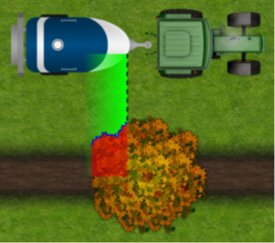
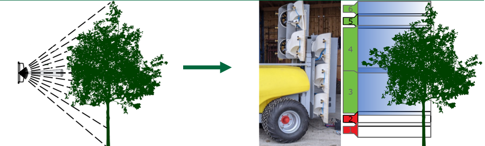

# Implementing automated section control sprayers for optimising pesticide application in orchards
We are conducting a decision analysis on optimizing pesticide application in orchards with an lidar sensor and an automated section controlled sprayer.
The aim is to identify possible uncertainties in the decision process of a farmer to adopt such an expensive technology and create a template that my help either the manufacture to adjust there product the their customers wishes or the farmer himself. 

So far we have identified several [key aspects](http://htmlpreview.github.io/?https://github.com/cemno/optimizing-pesticide-application-in-orchards/blob/dev/markdown-doc.html) of the decision.

We have also established a first model to visualise the expected dynamic of the decision and including the most important factors.

/

 

/

For a better visualisation of the automated section controlled sprayer in question we have two concept graphics:

/

