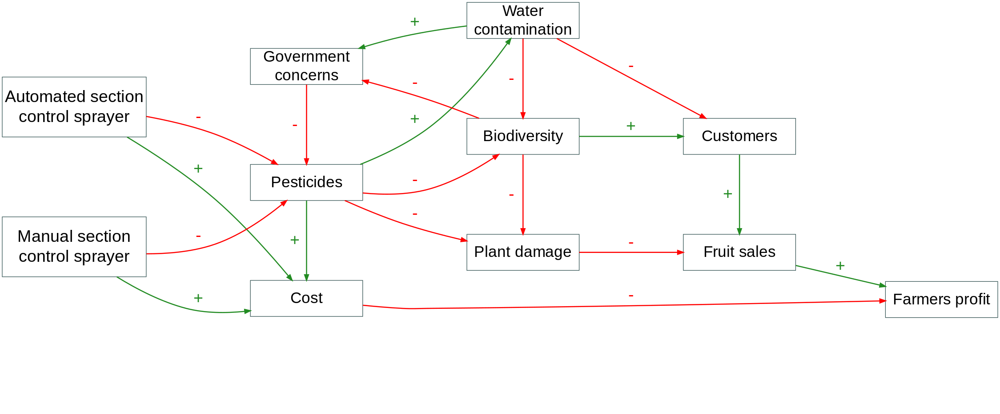
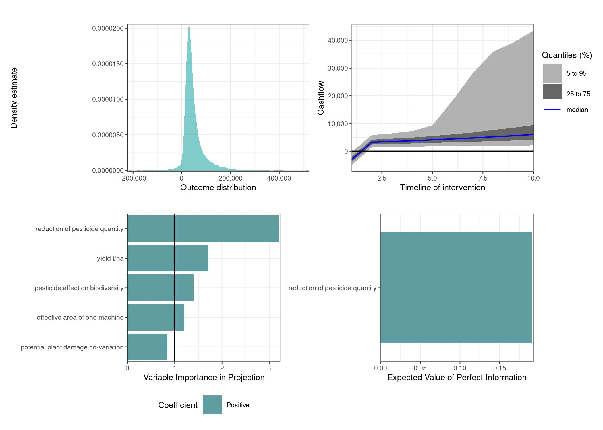

# Implementing automated section control sprayers for optimizing pesticide application in orchards
We are conducting a decision analysis on optimizing pesticide application in orchards with an lidar sensor and an automated section controlled sprayer.
The aim is to identify possible uncertainties in the decision process of a farmer to adopt such an expensive technology and create a template that may help either the manufacture to adjust there product to their customers wishes or the farmer himself. 

Take a look at our [full report](http://htmlpreview.github.io/?https://github.com/cemno/optimizing-pesticide-application-in-orchards/blob/main/project-report-optimizing-pesticide-application.html) of the decision.

We have also established a flow chart to visualize the dynamics of the decision and get a better understanding of our coded model.

 

  

For a better visualization of the automated section controlled sprayer in question we have two concept graphics:

The final compound figure shows a summary of the results of our decision analysis.

