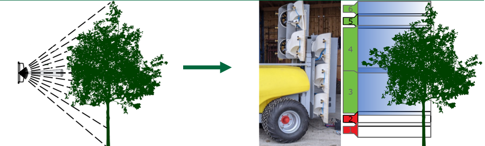

```{css include=FALSE}
body .main-container {
  max-width: 90%;
}
```

<script src="layout/hideOutput.js"></script>

```{r setup, include=FALSE}
# To get the correct cashflow plot one has to install the more recent version of the decisionSupport package from the creators github
# devtools::install_github("eikeluedeling/decisionSupport")
library(decisionSupport)
library(DiagrammeR)
library(DiagrammeRsvg)
library(ggplot2)
library(rsvg)
library(tidyverse)
library(knitr)

knitr::opts_chunk$set(
	message = FALSE,
	cache = FALSE,
	warnings = FALSE
)
```

```{r add_R_bib, include=FALSE}
knitr::write_bib(c(.packages(),
                   'knitr', 'decisionSupport', 'ggplot2', 'DiagrammR', 'tidyverse', 'DiagrammeRsvg', 'rsvg', 'base'), 'bib/packages.bib')
```
---
nocite: '@*'
---

# Abstract 

In this project we are looking at a prototype of an automated section-control 
sprayer (ASCS) which is currently being tested at Competence Centre for 
Fruit Production Lake Constance (Kompetenzzentrum Obstbau Bodensee, KOB; see fig. \@ref(fig:SCS) ) 
in its first season. It is compared on a monetary background to a manual 
section-control sprayer (MSCS) which is the current standard technology 
for spraying pesticides in orchards. Most of the sprayers are blower sprayers.

The main calculation to look at is whether the reduction of running-costs of the 
ASCS through lower pesticide usage compared to the MSCS are higher than the 
increased initial investment for the more expensive sprayer.

Other factors taken into consideration are the influence the reduction of 
pesticide usage has on the biodiversity and water contamination. These 
factors influence the likelihood of the government setting a restriction on the 
maximum amount of allowed pesticide to be applied. In addition, these factors 
influence the customer behavior.

The output of the model generated in this project shows a continuously higher net
present value (NPV) for the ASCS after year one. In the first year the profit is
heavily reduced due to the higher acquisition prize. The NPV is the discounted 
profit calculated based on the investment costs, running costs, damage to the 
fruits (apples) - calculated by combining applied pesticides 
(with a potential limit) and influences of the increased or decreased 
biodiversity - and the customer behavior.

\ 

# Introduction 

Reducing the use of pesticides in agricultural and horticultural production has 
been an important concern of policy makers, NGOs and also farmers for years. Not 
only is a reduction economically favorably on a farm level, but more and more 
negative impacts of the liberal use of agrochemicals on ecosystems have been 
reported in recent years. In orcharding, efforts have been made to make pesticide 
application more efficient in order to bring down the overall amount applied, 
while still securing fruit quality and stable yields. This led to the advent of 
blower sprayers capable of section control. This feature allows the operator to 
reduce or completely turn off the application of pesticides on a part of the 
total working width when it is appropriate. For instance, if a shorter tree 
comes up in a row of taller trees, the operator will manually turn off the 
topmost section of the blower sprayer to prevent pesticide being sprayed past 
the treetop into the environment. 

While the manually-operated section control sprayer (MSCS) is generally able to 
reduce pesticide application rates while maintaining the effectiveness of the 
agent, the strain it puts on the operator is exhausting and requires properly 
trained and experienced personnel. This limits the overall work capacity of one 
unit. Furthermore, because of the complex handling, errors are likely to occur
which diminishes the potential to reduce the ingress of agrochemicals into the
environment. 

Therefore, a novel technology is currently under development to automate the 
modulation of the section control feature of orchard sprayers. Light detection 
and ranging (LiDAR) sensors are mounted to the sprayer to allow a computer to 
assess the structure of the upcoming trees. This, in turn, enables the machine 
to appropriately adapt the individual sections according to the current 
requirements. Besides the immediate relief for the tractor driver, this 
technology also allows less experienced workers to operate section controlled 
sprayers. Therefore, an automatically-controlled section control sprayer (ASCS) 
has a higher work capacity than a manual section control sprayer (MSCS), 
i.e. a larger area can be sprayed in a given amount of time. Apart from that, 
pesticide reduction can be improved due to the higher precision in modulating 
the application rate following the principle of “as little as possible, as much
as necessary”. 

All in all, the ASCS promises a more efficient application of pesticide and 
higher work capacity per sprayer, as well as less contamination of the 
environment while maintaining full effectiveness in terms of plant protection. 

Decision analysis is a research approach aimed at developing rational 
recommendations to support real-word scenarios. When confronted with alternative 
options in a decision situation, decision makers often face complexity, limited 
information, and uncertainty about the factors influencing the system. 
Decision analysis deploys participatory methods to convene representatives of 
any stakeholder groups associated with the decision and its consequences 
[@luedeling2016]. The aim is to collect the current state of 
knowledge from experts and practitioners, while simultaneously creating 
awareness of the inevitable uncertainties associated with estimations 
[@Denis]. 
By accepting and openly communicating uncertainties, the need to understand all 
aspects of a system typically prominent in science is eliminated.
The introduction of Applied Information Economics by [@DouglasW] advanced the
field of decision analysis by establishing the use of probability distributions
and value ranges instead of precisely measured values as inputs for 
probabilistic simulations. After these simulations have calculated the whole
range of possible outcomes of the decision situation, knowledge gaps are 
identified where obtaining additional information would enhance the prediction
precision. To start an iterative process of model improvement, measures are taken
to improve the input data until the simulation output can confidently support 
the decision [@DouglasW].

This approach has been applied in a number of different fields, e.g. business 
decision support [@AliE], public health intervention planning [@Keith], 
policy process support [@Michael], and natural resource management [@ByronK].
\ 
```{r SCS, echo=FALSE, out.width="100%", fig.cap="In this image you can see the principal of section control sprayer. With the autmated one, which is currently under testing at the KOB, these section can be turned on/off on the fly."}

# cite this figure with \@ref(fig:figure-2.1)
```
\ 

# Decision framework

## Intervention

One of the aforementioned orchard farmers is in the market for a new pesticide 
sprayer because the one currently in use is approaching the end of its operational 
life (technologically outdated, repair costs, tax reasons). As it is the state
of the art, a section control sprayer is considered to be purchased. The farmer
faces the choice between i) a typical manually operated section control sprayer
(MSCS) or ii) an automated section control sprayer (ASCS) that relies on LiDAR
technology. As non-section control sprayer are outdated, such models are not 
taken into consideration here.

The initial investment costs for the ASCS option are higher up front compared 
to the MSCS option which involved less technical equipment, but several benefits
can be expected from the automated sprayer, which may have direct or indirect 
economic effects on the operating income of the orchard. In essence, the 
intervention situation is whether or not the orchard farmer should invest the 
extra expenses on the technically more sophisticated sprayer option (ASCS) 
instead of opting for the standard MSCS.

\ 

## Decision maker

Constituting the core of every decision analysis is the decision maker. This may
be a single person, but an institution or any other body can also be the 
decision maker in a particular situation [@luedeling2016]. In our case, we
identified German orchard farmers for this role, in particular those located in
southern Germany where fruit production in orchards is widely spread and quite
intensive. We define the orchard farmer as the farm manager who is in charge of
investment decision into new equipment. As he or she is typically familiar with
the situation on the orchard farm and aware of any small details that play into
an investment decision from an operational point of view, the farm manager plays
a crucial role in our decision model and is among the most important 
stakeholders of the decision. 

\ 

## Stakeholders

Several different institutions, groups of people, and other bodies are involved
in the decision.
They may either take part directly in the decision by communication and 
correspondence among the groups, or be indirectly affected by the decision and 
the consequences that ensue. Among them are, most importantly, the orchard 
farmer taking the investment decision and other farmers in a similar situation.
Apart from that we identified the manufactures of orchards sprayers, local water
suppliers, the Land and federal government, non-government organizations (NGOs),
consumers and customers, food retailers, agrochemical companies, beekeepers and
the local biodiversity as stakeholders.

\ 

# Data acquistion

## Research

For our project work we researched important values and facts, which we used to 
develop the questions for the calibration training, our questionnaire and
also for our model.

We used different tools to find out the values and facts we needed. We used
different platforms like Google scholar to find paper which related to our topic.
We also used different official websites from the German authorities like the 
Federal Office of Statistics for statistical data or values like how much area 
is used for orcharding, the Federal Environmental Agency for data about plant 
protection and the Federal Ministry of Finance.

Regarding prices and technology information about sprayers, we used websites
from agricultural machinery producers but also agricultural information websites. 

\ 

## Expert knowledge

For the decision-relevant questions, we consulted various stakeholders as experts 
for our model. We consulted several scientists from different apple growing
regions in Germany, leaders and technical assistants from the area of plant 
health, plant protection and production technology of the Competence Center 
for Fruit Production Lake Constance, as well as farmer from the lake constance 
region.

\ 

## Calibration training 

For a decision analysis it is important to know how valuable the given estimates
are, because it should be based on comprehensive and reliable knowledge.
Therefore, calibration training is applied.

Calibration is a process to find out and document how strong the deviation of an 
estimation form the reality is and how certain the aspiring expert was. This 
documentation is used to point flaws in estimating out and to level the playing 
field for further discussions. Due to calibration training the affective 
answering behaviour is reduced and it helps to improve the given estimates.
It also trains you to know your uncertainties and to give good estimates [@Cory].

In this case experts are used as a substitution of measuring devices. The
answers are normally linked to various cognitive biases and normally lead to an 
overconfidence of the experts about their estimates [@Cory].

To reduce this, a series of basic questions is used. In the first part of the 
calibration training the soon-to-be experts need to answer questions where
the correct answer must be within a certain range. In the second part they need
to answer yes or no questions and they need to estimate their confidence about
the given answers beeing correct. After answering the basic questions, they get 
the feedback about the given answers and their confidence intervals. This leads
to a reduction of overconfidence [@Cory]. 

After completing our calibration training, they were asked about estimates to
all inputs for our model with a 90% confidence interval.

\  

## Questionnaire 

In order to get reliable data we decided to do a short questionnaire and hand it
out to experts from the “Kompetenzzentrum Obstbau Bodensee”.

Before the Experts were asked the important questions, we needed values to, 
they had to answer general questions, so called calibrations questions. Find an
explanation for the calibration training above. These questions were asked to 
make the experts aware of possible estimation mistakes and bring down their
possible overconfidence about their answers.

In our Questionnaire we asked the experts six questions estimating the upper and
lower boundaries of the 90% confidence interval. We asked these questions to get reliable 
values from experts, because there was no open source information for these 
specific questions.

The first three questions were related to the cost of a new sprayer, how long 
this one can be used to apply plant protection agents in orcharding and how much
area can be sprayed with one sprayer. To find prices for new sprayers is very 
difficult because the agricultural machinery producers provide them only for
interested customers, since it is not fully on the market yet.
That’s way this question was asked. For the durability of sprayers there is
no available information, because it depends on how much it will be used and 
how. The experts should have a good knowledge about the durability of a
sprayer in orcharding. The third question was asked because in orcharding you 
should be able to spray all trees in a specified amount of time if there is an
important treatment which needs to be done quickly. One section controlled
sprayer can not be used for 100 hectare or more like in normal farming.

The next three questions were related to the cost of plant protection products
per hectare, the percentages of plant protection which gets lost through 
different influences and about the possibility to reduce these losses with the
new automated sprayers. Plant protection is a costly factor in orcharding and 
important for calculating our model. Therefore, we asked the experts for their 
estimates. The question about the lost percentage due to drift or space between 
the trees was a difficult question, because no values could be found on the 
internet. The last question was asked to find out what the experts think about
the possibility that the new technology could reduce the losses.

\ 

## Input tabel

```{r include=FALSE}
input_table <- read.csv("data/input_data_03.csv",sep = ";",
                        dec = ",", stringsAsFactors = FALSE)
input_table <- drop_na(input_table, c("lower","upper"))
input_table <- filter(input_table, !variable == "initial_aut_cost",
                      !variable == "pesticide_quantity")
input_table <- input_table[ order(input_table$distribution,
                                  input_table$variable), ]
write.csv(input_table, "data/final/inputs.csv", row.names = FALSE)
input_table <- read.csv("data/final/inputs.csv", stringsAsFactors = FALSE)
input_table <- input_table %>% format(scientific = FALSE, trim = TRUE, drop0trailing = TRUE)
```

We split the input table in three sections:
<ul>
  <li>variables with a `const` distribution</li>
  <li>variables with a `posnorm` distribution</li>
  <li>variables with a `tnorm_0_1` distribution</li>
</ul>

Included in the first section are mostly our relative variables, like the 
relative biodiversity or water contamination (`rel_biodiversity`, 
`rel_water_contamination`). These start at a value of `1` in the first year, but
increase or decrease over time. 
The only odd one in this section might be `n_years`, which is set to 10, because
our model is at the moment intended to run for this long. This is still 
adjustable depending on possible other decisions with varying circumstances.

```{r echo=FALSE, results='asis'}
input_table[1:7] %>% 
  filter(distribution == "const") %>% 
  kable()
```

\ 

The second section describes our frequentative, so noniterative, variables. 
Included here are e.g. the initial costs of the sprayers (`initial_man_cost`,
`initial_upg_cost`), but also percentage values like the achievable pesticide
reduction, through using the automated sprayer (`pesticide_reduction_auto	`).
Odd variables might seemingly be the `discount_rate` and the `var_CV`, but both 
of them belong to the positive-normal distributed section.

```{r echo=FALSE, results='asis'}
input_table[1:7] %>% 
  filter(distribution == "posnorm") %>% 
  kable()
```

\ 

Mostly influence factors are present in our last section. These describe the
influence that e.g. the pesticides have on the biodiversity 
(`pesticide_on_biodiversity_factor`).
The `government_intervention_chance` is sorted in here as well, as it is also a
procentual value in the range from 0 to 1.

```{r echo=FALSE, results='asis'}
input_table[1:7] %>% 
  filter(distribution == "tnorm_0_1") %>% 
  kable()
```
# Model

## Flow chart


The following graph, fig. \@ref(fig:flowchart), is meant to give a better 
understanding of our model.
We included two different sprayers, the automated and the manual sprayer seen on
the far left of the model. Those mainly effect the amount of needed pesticides
and plant protection agents but also the initial cost.
Pesticides are the main factor in our model. They effect water contamination,
biodiversity, plant damage and the cost through the amount applied. \ 

We chose the duration of our model to be 10 years since most farmers replace 
their sprayers around this time. The model had to be partly iterative, since most 
variables have an effect on variables in the following years.

One Example for this is the amount we spray and the plant damage. If the farmer 
sprayed enough then there won't be any damage, but if he or she estimated the 
amount incorrectly and sprayed less then needed, then the plant damage in the 
following year will be effected. <br>
Something similar can be said about the customers. If we spray a lot then
the water contamination increases and the biodiversity on the field 
decreases, this change is being picked up by the customers through the news, 
magazines or first hand if they are residents nearby.

Existing plant damage and fewer customers will reduce the harvest and thus 
lessen the fruit sales. The sales and minus the overall costs will create the
farmers profit, which is the output variable we want to analyze.

Lastly we also included an event, representing the government intervening in the 
amount we are allowed to spray. This has an impact especially in years the 
farmer has to spray a lot. Here the impact on the manual sprayer will be bigger, 
as the automated sprayer reduces the overall amount of needed pesticides.
The chance of the government intervening is initially set low, but is influenced
by the water contamination and the biodiversity. We also included a delay 
between the government decision and the implementation of it. This delay can 
vary between two and six years, because various governmental institutions or
decisions take less time than others.


<div class = "fold s">
```{r}

model_flow_chart <- grViz("

digraph {
  
  # Add general information which counts for everything!!!
  
  # ---------
  # Change flow chart orientation (top down: 'TD'; left to right: 'LR' 
  rankdir = 'LR'
  
  # Add graph statements 
  graph [#label = 'Initial Model',
         labelloc = t,
         fontsize = 45,
         ranksep=2,
         nodesep=1]
  
  # Add node statements
  node [fontname = Arial,
        fontcolor = black,
        color = darkslategray,
        penwidth = 1]
  
  # Add edge statements
  edge [fontsize=30,
        penwidth=2,
        fontname=Arial]
  # ---------  
  
  # ---------  
  # create 'ranks' (basically nodes) for arranging nodes later on
  rank1 [style=invis]
  rank2 [style=invis]
  rank3 [style=invis]
  rank4 [style=invis]
  rank5 [style=invis]
  
  # make invisible (white) links between them
  rank1->rank2->rank3->rank4->rank5 [color=white]
  # ---------  
  
  # ---------  
  # Add specific statements for node group {Intervention & Alternatives} 
  node [shape = box,
        fontsize = 30,
        fixedsize = true,
        width = 3.6,
        height = 1.5]

    Ascs [label = 'Automated section \n control sprayer'];
    Al1 [label = 'Manual section \n control sprayer'];
  # ---------
  
  
  
  # Add specific statements for node group {Pesticides & Cost} 
  # --------- 
  node [shape = box,
        fontsize = 28,
        fixedsize = true,
        width = 2.8,
        height = 0.9]
  
  Pe [label = 'Pesticides'];
  Co [label = 'Cost']
  
  Cu [label = 'Customers'];          
  Di [label = 'Plant damage'];
  Bio [label = 'Biodiversity'];
  WC [label = 'Water \n contamination'];
  
  FS [label = 'Fruit sales'];
  GC [label = 'Government \n concerns'];
  
  FP [label = 'Farmers profit']
  
  # ---------  
  
  
  # Add edge statements for negative connection (arrows) and add the connections
  # ---------  
  edge [label = '-    ',
        fontcolor = 'red',
        color = 'red']
  {Ascs Al1} -> Pe #[headport = w, tailport = e]
  GC -> Pe
  Pe->Bio #[headport = w]
  Pe-> Di 
  Bio->{Di GC}
  WC->{Bio Cu}
  Di->FS
  Co->FP
  # ---------  
  
  # Add edge statements for positive connection (arrows) and add the connections
  # ---------  
  edge [label = '+',
        fontcolor = 'forestgreen',
        color = 'forestgreen']
  
  {Ascs Al1}->Co #[headport = w, tailport = s]
  Pe-> WC  #[headport = w, tailport = n]
  Pe-> Co
  FS->FP 
  WC->GC 
  Bio-> Cu
#  Di -> Pe
  Cu->FS
  # ---------  
  
  # ---------  
  # sorting the nodes per rank
  
  {
    Ascs -> Al1 -> rank1 [style=invis];
    rank=same;
    rankdir=TD;
  }
  
  {
    Co -> Pe -> GC -> rank2 [style=invis];
    rank=same;
    rankdir=TD;
  }
  
  {
    Di -> Bio -> WC -> rank3 [style=invis];
    rank=same;
    rankdir=TD;
  }
  
  {
    Cu -> FS -> rank4 [style=invis];
    rank=same;
    rankdir=TD;
  }
 
#   {
#     rank5 -> FS [style=invis];
#     rank=same;
#     rankdir=DT;
#   }
#   
  # ---------  
  
}")
```
</div>

```{r flowchart, echo=FALSE, out.width="100%", cache=FALSE,fig.cap="The flowchart modelling the farmers two decision options. This chart shows the simplified interconnections of our variables. Red indicates a negativ relationship and green a positive."}
# Plot flow chart 
model_flow_chart

# Export flow chart as .png files; save in "images" folder 
rsvg_png(charToRaw(export_svg(model_flow_chart)), "images/flow-chart.png")

```

## Code {.tabset}

### Walkthrough  {-}

In the following chapters we show and explain the code of our model chunk by 
chunk. To see the code in its entirety please consult the [Full model code](#fullcode) tab next 
to this one.

#### Input data {-}

The first step in creating our model is to load in our input variables from the 
excel file.<br>
We optionally tidy our file up with `drop_na`, `filter`, `order` and
write the clean file to a new directory. Now we import the final excel file.<br>
In the Script we often use the `_man` or `_aut` abbreviation as an 
suffix to indicate which sprayer (ASCS  or MSCS) variables we are modifying.

<!-- <blockquote> -->
<!--   <p><span style="font-family: consolas;"> -->
 <!-- <br> for linebreaks  -->
```
input_table <- read.csv("data/input_data_03.csv",sep = ";",
                        dec = ",", stringsAsFactors = FALSE)
input_table <- drop_na(input_table, c("lower","upper"))
input_table <- filter(input_table, !variable == "initial_aut_cost",
                      !variable == "pesticide_quantity")
input_table <- input_table[ order(input_table&amp;distribution,
                                  input_table$variable), ]
write.csv(input_table, "data/final/inputs.csv", row.names = FALSE)
input_table <- read.csv("data/final/inputs.csv", stringsAsFactors = FALSE)
```
<!--   </span></p> -->
<!-- </blockquote> -->

<!-- ## Auxiliary table -->

After we loaded in all our predefined variables we need to define the iterative 
variables. For this we start writing our function `ascs_decision_model`. <br>
We created an `auxiliary_table` with `n_years` amount of rows and all the relevant
variables in the columns, to make the calculations of the variables 
faster.<br>
At this point we defined the values for each year as `0`.

```
ascs_decision_model <- function(x, varnames){
  
  auxiliary_table <- data.frame(year = c(1:n_years),
                                pest_quant_man = rep(0.,n_years),
                                pest_quant_aut = rep(0.,n_years),
                                rel_water_cont_man = rep(0.,n_years),
                                rel_water_cont_aut = rep(0.,n_years),
                                rel_bio_man = rep(0.,n_years),
                                rel_bio_aut = rep(0.,n_years),
                                plant_dmg_pot_man = rep(0.,n_years),
                                plant_dmg_pot_aut = rep(0.,n_years),
                                actual_plant_dmg_man = rep(0.,n_years),
                                actual_plant_dmg_aut = rep(0.,n_years),
                                gov_inter_chance_man = rep(0.,n_years),
                                gov_inter_chance_aut = rep(0.,n_years),
                                gov_inter_happened_man = rep(0,n_years),
                                gov_inter_happened_aut = rep(0,n_years),
                                gov_reaction = rep(0,n_years)
                                )
```
#### For-loop {.tabset - #For-loop}

##### First year{-}
 
To iterate through each year we set the `for`-loop to be `n_years` long.
Furthermore we kept in mind that `n_years` can vary and kept our model dynamic
and easily adaptable for other cases. <br>

The next step in the `for`-loop is to overwrite all the iterative variables for 
the first year (`if (y == 1)`. Here we first change the government reaction to a
number randomly derived from between the `government_reaction_time` boundaries 
from the input table. This delay is used later on and represents the time 
between the government decision and its implementation. <br>

The `chance` that the government intervenes is covered by (pre-)assumptions for
the first year, it is directly taken from the input table. In later years it
will be effected by the biodiversity and water contamination.

We also make sure that the government intervention happens only inside the 
`n_years` boundaries, because it wouldn't have any effect on our model.

```
  for (y in 1:n_years) {
  
    if (y == 1) {
    lower <- input_table[input_table$variable ==
                           "government_reaction_time", "lower"]
    upper <- input_table[input_table$variable ==
                           "government_reaction_time", "upper"]
    auxiliary_table$gov_reaction <- round(runif(n_years,lower,upper))
    
    auxiliary_table$gov_inter_chance_man[y] <- government_intervention_chance 
    auxiliary_table$gov_inter_chance_aut[y] <-
      auxiliary_table$gov_inter_chance_man[y]
    
    if ((y + auxiliary_table$gov_reaction[y]) <= n_years) {
      auxiliary_table$gov_inter_happened_man[y + 
        auxiliary_table$gov_reaction[y]] <- chance_event(
        auxiliary_table$gov_inter_chance_man[y], 1, 0)
      auxiliary_table$gov_inter_happened_aut[y +
        auxiliary_table$gov_reaction[y]] <- chance_event(
        auxiliary_table$gov_inter_chance_aut[y], 1, 0)
    }
```

In the following part we use the `vv()` function to get values for the influence
factors. Those include the influence from pesticides on water contamination and 
biodiversity but also from water contamination on biodiversity.
Further we import the factor that describes how much reduction can be achieved 
by using the automated sprayer (`pesticide_reduction_auto`) from the input 
table. This value gets subtracted from 1 to get a reduction by multiplying with
this factor.

```
    pest_cont_fac <- vv(pesticide_on_water_contamination_factor, var_CV, 1)
    pest_bio_fac <- vv(pesticide_on_biodiversity_factor, var_CV, 1)
    cont_bio_fac <- vv(water_contamination_on_biodiversity_factor, var_CV, 1)
    
    pest_red_fac <- 1 - pesticide_reduction_auto    
```

To get to the actual plant damage we initially define a potential plant damage
for every year. This potential damage will be effected by the amount of pesticides 
sprayed and the biodiversity changes in the following years.

Now we let the pesticide quantity correlate with the potential plant damage.<br>
The idea here is that the farmer tries to spray enough but not to much. This
estimation is prone to errors, so we chose to multiply the potential plant damage 
with a randomly drawn number from the 90% confidence interval of the borders
defined in the `farmers_pesticide_quantity_miscalculation` variable.<br>
The amount of pesticide usage for the automated sprayer is further multiplied by
the pesticide reduction factor (`pest_red_fac`). This represents the further
reduction of pesticide usage through using the ASCS instead of the MSCS.

```
    auxiliary_table$plant_dmg_pot_man <-
      vv(potential_plant_damage, potential_plant_damage_CV, n_years)
    auxiliary_table$plant_dmg_pot_aut <- auxiliary_table$plant_dmg_pot_man
    
    lower <- input_table[input_table$variable ==
                           "farmers_pesticide_quantity_miscalculation", "lower"]
    upper <- input_table[input_table$variable ==
                           "farmers_pesticide_quantity_miscalculation", "upper"]
    auxiliary_table$pest_quant_man <-
      auxiliary_table$plant_dmg_pot_man *
      rposnorm90ci(n_years, lower = lower, upper = upper)
    auxiliary_table$pest_quant_aut <-
      auxiliary_table$pest_quant_man *
      pest_red_fac
```

We decided that the biodiversity and water contamination will be relative and
set it for the first year to 1. They will increase or decrease in the following 
years, depending on the pesticide usage.<br>
The amount that was sprayed is subtracted from potential plant damage to get to 
the actual plant damage.<br>
We made an optional check to make sure that the actual plant damage is not
below zero.<br>

```
    auxiliary_table$rel_water_cont_man[y] <- 1 
    auxiliary_table$rel_water_cont_aut[y] <- 1 
    auxiliary_table$rel_bio_man[y] <- 1
    auxiliary_table$rel_bio_aut[y] <- 1
    
    actual_plant_dmg_man <- auxiliary_table$plant_dmg_pot_man[y] -
      auxiliary_table$pest_quant_man[y]
    auxiliary_table$actual_plant_dmg_man[y] <- ifelse(actual_plant_dmg_man < 0,
      0, actual_plant_dmg_man)
    
    actual_plant_dmg_aut <- auxiliary_table$plant_dmg_pot_aut[y] -
      auxiliary_table$pest_quant_aut[y] / pest_red_fac
    auxiliary_table$actual_plant_dmg_aut[y] <- ifelse(actual_plant_dmg_aut < 0,
      0, actual_plant_dmg_aut)
``` 

With this we are finished with everything regarding the first year. If you want
to check the calculations for the second and following years, you need to go 
back to the beginning of the [For-loop](#For-loop) chapter and select the corresponding tab.


##### Following years {-}

For the following years (year 2 - `n_years`) a lot of variables are varying.<br>

The first change is in the chance for the government intervention. This is
depending on the variation in biodiversity and water contamination. <br>
We also check for the chance being between 1 and 0.

```
    }else {
    auxiliary_table$gov_inter_chance_man[y] <-
      auxiliary_table$gov_inter_chance_man[y-1] +
      ( ((1 - auxiliary_table$rel_bio_man[y-1]) * biodiversity_on_gov_concern) + 
      ((auxiliary_table$rel_water_cont_man[y-1] - 1) *
         water_contamination_on_gov_concern))
    
    auxiliary_table$gov_inter_chance_aut[y] <-
      auxiliary_table$gov_inter_chance_aut[y-1] +
      ( ((1 - auxiliary_table$rel_bio_aut[y-1]) * biodiversity_on_gov_concern) + 
      ((auxiliary_table$rel_water_cont_aut[y-1] - 1) *
         water_contamination_on_gov_concern))
    
    auxiliary_table$gov_inter_chance_man[y] <- 
      ifelse(auxiliary_table$gov_inter_chance_man[y] <= 0,
             0,
             ifelse(auxiliary_table$gov_inter_chance_man[y] >= 1,
                    1,
                    auxiliary_table$gov_inter_chance_man[y]))
    
    auxiliary_table$gov_inter_chance_aut[y] <-
      ifelse(auxiliary_table$gov_inter_chance_aut[y] <= 0,
             0,
             ifelse(auxiliary_table$gov_inter_chance_aut[y] >= 1,
                    1,
                    auxiliary_table$gov_inter_chance_aut[y]))
```

Now for the `chance_event` function itself. <br>
The event can only take place if the intervention delay added to the current
year lies inside the `n_years` range and there was no intervention in the last
year or in the relevant year already. <br>
If the event takes place, then the amount of pesticides legally allowed to be 
sprayed will be changed to a fixed number for the relevant years and following.
This will have an especially big impact on the manual sprayer, since the amount
sprayed by the automated sprayer is always lower.


```
    if(auxiliary_table$gov_inter_happened_man[y-1] == 0){
      if(y + auxiliary_table$gov_reaction[y] <= n_years){
        if(auxiliary_table$gov_inter_happened_man[
          y + auxiliary_table$gov_reaction[y]] == 0){
          auxiliary_table$gov_inter_happened_man[
            y + auxiliary_table$gov_reaction[y]] <-
            chance_event(auxiliary_table$gov_inter_chance_man[y], 1, 0)
        }
      }
    }else{
      auxiliary_table$gov_inter_happened_man[y] <- 1
    }
    
    if(auxiliary_table$gov_inter_happened_aut[y-1] == 0){
      if(y + auxiliary_table$gov_reaction[y] <= n_years){
        if(auxiliary_table$gov_inter_happened_aut[
          y + auxiliary_table$gov_reaction[y]] == 0){
          auxiliary_table$gov_inter_happened_aut[
            y + auxiliary_table$gov_reaction[y]] <-
            chance_event(auxiliary_table$gov_inter_chance_aut[y], 1, 0)
        }
      }  
    }else{
      auxiliary_table$gov_inter_happened_aut[y] <- 1
    }
```

To get the values of biodiversity and water contamination of the current year,
we multiply the pesticide quantity from the last year with the respective 
influence factor and add it to the biodiversity and water contamination of last 
year. The current biodiversity is additionally influenced through the water 
contamination of the last year.

```
    auxiliary_table$rel_water_cont_man[y] <-
      auxiliary_table$rel_water_cont_man[y-1] +
      ((auxiliary_table$pest_quant_man[y-1] - 1) * pest_cont_fac)
    auxiliary_table$rel_water_cont_aut[y] <-
      auxiliary_table$rel_water_cont_aut[y-1] +
      ((auxiliary_table$pest_quant_aut[y-1] - 1) * pest_cont_fac)
          
    auxiliary_table$rel_bio_man[y] <- auxiliary_table$rel_bio_man[y-1] +
      ((1 - auxiliary_table$pest_quant_man[y-1]) * pest_bio_fac) +
      ((1 - auxiliary_table$rel_water_cont_man[y-1]) * cont_bio_fac)
    auxiliary_table$rel_bio_aut[y] <- auxiliary_table$rel_bio_aut[y-1] +
      ((1 - auxiliary_table$pest_quant_aut[y-1]) * pest_bio_fac) +
      ((1 - auxiliary_table$rel_water_cont_aut[y-1]) * cont_bio_fac)
```

The present potential plant damage and pesticide quantity get reduced by the
newly calculated biodiversity. The idea here is that the pests get reduced 
through the higher biodiversity.

```
    auxiliary_table$plant_dmg_pot_man[y] <-
      auxiliary_table$plant_dmg_pot_man[y] +
      auxiliary_table$plant_dmg_pot_man[y] *(1 -  auxiliary_table$rel_bio_man[y])
    auxiliary_table$plant_dmg_pot_aut[y] <- 
      auxiliary_table$plant_dmg_pot_aut[y] +
      auxiliary_table$plant_dmg_pot_aut[y] *(1 -  auxiliary_table$rel_bio_aut[y])
    
    auxiliary_table$pest_quant_man[y] <- auxiliary_table$pest_quant_man[y] +
      auxiliary_table$pest_quant_man[y] * (1 - auxiliary_table$rel_bio_man[y])
    auxiliary_table$pest_quant_aut[y] <- (auxiliary_table$pest_quant_aut[y] +
      auxiliary_table$pest_quant_aut[y] * (1 - auxiliary_table$rel_bio_aut[y]))
```

Since everything in the `if`-loop part is calculated for the first year only,
the actual plant damage and the effect of the intervention must be calculated 
for the following years again.

```
    auxiliary_table$pest_quant_man[y] <-
  ifelse(auxiliary_table$gov_inter_happened_man[y] == 0,
         auxiliary_table$pest_quant_man[y],
         ifelse(auxiliary_table$pest_quant_man[y] >
                  government_pesticide_quantity,
                government_pesticide_quantity,
                auxiliary_table$pest_quant_man[y]))

    auxiliary_table$pest_quant_aut[y] <-
      ifelse(auxiliary_table$gov_inter_happened_aut[y] == 0,
             auxiliary_table$pest_quant_aut[y],
             ifelse(auxiliary_table$pest_quant_aut[y] >
                      government_pesticide_quantity,
                    government_pesticide_quantity,
                    auxiliary_table$pest_quant_aut[y]))
    
    actual_plant_dmg_man <-
      auxiliary_table$plant_dmg_pot_man[y] -
      auxiliary_table$pest_quant_man[y]
    auxiliary_table$actual_plant_dmg_man[y] <- ifelse(actual_plant_dmg_man < 0,
                                                      0,
                                                      actual_plant_dmg_man)
          
    actual_plant_dmg_aut <-
      auxiliary_table$plant_dmg_pot_aut[y] -
      auxiliary_table$pest_quant_aut[y] /
      pest_red_fac
    auxiliary_table$actual_plant_dmg_aut[y] <- ifelse(actual_plant_dmg_aut < 0,
                                                      0,
                                                      actual_plant_dmg_aut)
  }
```

#### Output {-}

Many variables are not iterative but still vary:
<ul>
  <li>`yield` depending on the year and plant damage</li>
  <li>`market prices` depending on the year</li>
  <li>`fruit sales` depending on the yield and the market price</li>
  <li>`pesticide costs per hectare` depending on the year</li>
  <li>`pesticide costs per hectare and sprayer` depending additionally on the amount sprayed</li>
  <li>`machine costs` depending on the brand, year, and if its automated or manual</li>
  <li>`customers` depending on biodiversity and water contamination</li>
  <li>`profit` depending on fruit sales, pesticide costs, hectare, customers and machine costs</li>
</ul>

```
    yield_t_ha <- vv(yield, var_CV, n_years)
    yield_t_ha_man <- yield_t_ha * (1 - auxiliary_table$actual_plant_dmg_man)
    yield_t_ha_aut <- yield_t_ha * (1 - auxiliary_table$actual_plant_dmg_aut)
    
    market_price_e_t <- vv(market_price, var_CV, n_years)
    
    fruit_sales_e_ha_man <- yield_t_ha_man * market_price_e_t
    fruit_sales_e_ha_aut <- yield_t_ha_aut * market_price_e_t
    
    pest_cost_ha_const <- vv( pesticide_cost, var_CV, n_years )
    pest_cost_ha_man <- pest_cost_ha_const * auxiliary_table$pest_quant_man
    pest_cost_ha_aut <- pest_cost_ha_const * auxiliary_table$pest_quant_aut
    
    machine_cost_man <- c( initial_man_cost, rep( 0, (n_years-1) ) )
    machine_cost_aut <- machine_cost_man + c( initial_upg_cost,
                                              rep( 0, (n_years-1) ) )
    
    customers_man <- rep(customer_on_fruitsales, n_years) +
      (auxiliary_table$rel_bio_man - 1) * biodiversity_on_customer +
      (1 - auxiliary_table$rel_water_cont_man) * water_contamination_on_customer
    customers_aut <- rep(customer_on_fruitsales, n_years) +
      (auxiliary_table$rel_bio_aut - 1) * biodiversity_on_customer +
      (1 - auxiliary_table$rel_water_cont_aut) * water_contamination_on_customer
      
    farmers_profit_man = (fruit_sales_e_ha_man * customers_man -
                            pest_cost_ha_man) * area_per_machine - machine_cost_man
    farmers_profit_aut = (fruit_sales_e_ha_aut * customers_aut -
                            pest_cost_ha_aut) * area_per_machine - machine_cost_aut
```

The profits get discounted to generate the respective net present value.
We chose a discount rate between 2 and 5 %, since our farmers are likely to invest.<br>
In the end we return the calculated NPVs, the difference between the NPVs and
the cashflow to further plot and analyze them.

```
    NPV_aut = discount(farmers_profit_aut, discount_rate, calculate_NPV = TRUE)
    NPV_man = discount(farmers_profit_man, discount_rate, calculate_NPV = TRUE)
    
    return(list(Interv_NPV = NPV_aut,
                NO_Interv_NPV = NPV_man,
                NPV_decision_do = NPV_aut - NPV_man,
                Cashflow_decision_do = farmers_profit_aut - farmers_profit_man))
}
```
### Full model code {.unnumbered #fullcode}

As a reference we added the whole model code with short comments to make it more readable as a whole.

<!-- <div class = "fold s"> -->
```{r}

# Importing and adjusting input table 
input_table <- read.csv("data/input_data_03.csv", sep = ";", dec = ",",
                        stringsAsFactors = FALSE)
input_table <- drop_na(input_table, c("lower","upper"))
input_table <- filter(input_table, !variable == "initial_aut_cost",
                      !variable == "pesticide_quantity") 
input_table <- input_table[ order(input_table$distribution,
                                  input_table$variable), ]
write.csv(input_table, "data/final/inputs.csv", row.names = FALSE)
input_table <- read.csv("data/final/inputs.csv", stringsAsFactors = FALSE)


ascs_decision_model <- function(x, varnames){
  
  # table for iterative impacted variables 
  auxiliary_table <- data.frame(year = c(1:n_years),
                                pest_quant_man = rep(0.,n_years),
                                pest_quant_aut = rep(0.,n_years),
                                rel_water_cont_man = rep(0.,n_years),
                                rel_water_cont_aut = rep(0.,n_years),
                                rel_bio_man = rep(0.,n_years),
                                rel_bio_aut = rep(0.,n_years),
                                plant_dmg_pot_man = rep(0.,n_years),
                                plant_dmg_pot_aut = rep(0.,n_years),
                                actual_plant_dmg_man = rep(0.,n_years),
                                actual_plant_dmg_aut = rep(0.,n_years),
                                gov_inter_chance_man = rep(0.,n_years),
                                gov_inter_chance_aut = rep(0.,n_years),
                                gov_inter_happened_man = rep(0,n_years),
                                gov_inter_happened_aut = rep(0,n_years),
                                gov_reaction = rep(0,n_years)
                                )
  
  
  for (y in 1:n_years) {
    
    if (y == 1) { # first year
      # fix for one run
      ## generating a vector for the government reaction delay 
      lower <- input_table[input_table$variable ==
                             "government_reaction_time", "lower"]
      upper <- input_table[input_table$variable ==
                             "government_reaction_time", "upper"]
      auxiliary_table$gov_reaction <- round(runif(n_years,lower,upper))
      
      # general chance that government intervenes
      # in year 1 this is covered by (pre-)assumptions
      ## will be affected by biodiversity and water contamination later on 
      auxiliary_table$gov_inter_chance_man[y] <-
        government_intervention_chance 
      auxiliary_table$gov_inter_chance_aut[y] <-
        auxiliary_table$gov_inter_chance_man[y]
      # chance event of government intervention takes only place if the reaction
      # delay is inside our n_years boundaries 
      if ((y + auxiliary_table$gov_reaction[y]) <= n_years) {
        auxiliary_table$gov_inter_happened_man[
          y + auxiliary_table$gov_reaction[y]] <- chance_event(
            auxiliary_table$gov_inter_chance_man[y], 1, 0)
        
        auxiliary_table$gov_inter_happened_aut[
          y + auxiliary_table$gov_reaction[y]] <- chance_event(
            auxiliary_table$gov_inter_chance_aut[y], 1, 0)
      }
      # influence factor from pesticides on water contamination ## fix per run
      pest_cont_fac <- vv(pesticide_on_water_contamination_factor, var_CV, 1)
      # influence factor from pesticides on biodiversity ## fix per run
      pest_bio_fac <- vv(pesticide_on_biodiversity_factor, var_CV, 1)
      # influence factor from water contamination on biodiversity ## fix per run
      cont_bio_fac <- vv(water_contamination_on_biodiversity_factor, var_CV, 1)
      # pesticide reduction factor when using the automated sprayer
      ## 1- because it would be negativ in the pls analysis otherwise
      pest_red_fac <- 1 - pesticide_reduction_auto
      
      # potential plant damage vector for n_years
      # its the same for both decisions 
      ## will be affected by biodiversity later on 
      auxiliary_table$plant_dmg_pot_man <-vv(potential_plant_damage,
                                             potential_plant_damage_CV, n_years)
      auxiliary_table$plant_dmg_pot_aut <-auxiliary_table$plant_dmg_pot_man
      
      # manual correlation between pesticide quantity and potential plant damage
      ## the farmer tries to assess how much plant damage there will be and sets
      ## the applied pest quantity accordingly      
      lower <- input_table[input_table$variable ==
                             "farmers_pesticide_quantity_miscalculation","lower"]
      upper <- input_table[input_table$variable ==
                             "farmers_pesticide_quantity_miscalculation","upper"]
      auxiliary_table$pest_quant_man <- auxiliary_table$plant_dmg_pot_man *
        rposnorm90ci(n_years, lower = lower, upper = upper)
      auxiliary_table$pest_quant_aut <- auxiliary_table$pest_quant_man *
        pest_red_fac
      
      # biodiversity and water contamination are 1 in the first year ("status quo")
      auxiliary_table$rel_water_cont_man[y] <- 1 
      auxiliary_table$rel_water_cont_aut[y] <- 1 
      
      auxiliary_table$rel_bio_man[y] <- 1
      auxiliary_table$rel_bio_aut[y] <- 1
      
      # actual plant damage 
      ## actual plant damage = potential plant damage - quantity sprayed
      ## the automated needs less spraying to counter the same amount
      ## of potential plant damage (/ pest_red_fac)
      actual_plant_dmg_man <- auxiliary_table$plant_dmg_pot_man[y] -
        auxiliary_table$pest_quant_man[y]
      auxiliary_table$actual_plant_dmg_man[y] <-ifelse(actual_plant_dmg_man < 0,
                                                       0,
                                                       actual_plant_dmg_man)
      
      actual_plant_dmg_aut <- auxiliary_table$plant_dmg_pot_aut[y] -
        auxiliary_table$pest_quant_aut[y] / pest_red_fac
      auxiliary_table$actual_plant_dmg_aut[y] <-ifelse(actual_plant_dmg_aut < 0,
                                                       0,
                                                       actual_plant_dmg_aut)
      
    }else  {  # ongoing years (year 2 - n_years) 
      ## the values change per year so the influence changes as well
      # government intervention chance
      ## general chance affected by biodiversity and water contamination 
      auxiliary_table$gov_inter_chance_man[y] <- 
        auxiliary_table$gov_inter_chance_man[y-1] +
        ( ((1 - auxiliary_table$rel_bio_man[y-1]) *
             biodiversity_on_gov_concern) + 
            ((auxiliary_table$rel_water_cont_man[y-1] - 1) *
               water_contamination_on_gov_concern))
      
      auxiliary_table$gov_inter_chance_aut[y] <-
        auxiliary_table$gov_inter_chance_aut[y-1] +
        ( ((1 - auxiliary_table$rel_bio_aut[y-1]) *
             biodiversity_on_gov_concern) +
            ((auxiliary_table$rel_water_cont_aut[y-1] - 1) *
               water_contamination_on_gov_concern))
      
      # checking if the chance is really between 0 and 1 so the chance_event function works
      auxiliary_table$gov_inter_chance_man[y] <- ifelse(
        auxiliary_table$gov_inter_chance_man[y] <= 0,
        0,
        ifelse(auxiliary_table$gov_inter_chance_man[y] >= 1,
               1,
               auxiliary_table$gov_inter_chance_man[y]))
      
      auxiliary_table$gov_inter_chance_aut[y] <- ifelse(
        auxiliary_table$gov_inter_chance_aut[y] <= 0,
        0,
        ifelse(auxiliary_table$gov_inter_chance_aut[y] >= 1,
               1,
               auxiliary_table$gov_inter_chance_aut[y]))
      
      
      # chance_event function 
      ## only applies if the value for the intervention delay +
      ##the current year is still inside the n_years boarder &
      ### there was no intervention in the previous years
      ### there was no intervention in the relevant year already
      if(auxiliary_table$gov_inter_happened_man[y-1] == 0){
        if(y + auxiliary_table$gov_reaction[y] <= n_years){
          if(auxiliary_table$gov_inter_happened_man[
            y + auxiliary_table$gov_reaction[y]] == 0){
            auxiliary_table$gov_inter_happened_man[
              y + auxiliary_table$gov_reaction[y]] <-
              chance_event(auxiliary_table$gov_inter_chance_man[y], 1, 0)
          }
        }
      }else{
        auxiliary_table$gov_inter_happened_man[y] <- 1
      }
      
      if(auxiliary_table$gov_inter_happened_aut[y-1] == 0){
        if(y + auxiliary_table$gov_reaction[y] <= n_years){
          if(auxiliary_table$gov_inter_happened_aut[
            y + auxiliary_table$gov_reaction[y]] == 0){
            auxiliary_table$gov_inter_happened_aut[
              y + auxiliary_table$gov_reaction[y]] <-
              chance_event(auxiliary_table$gov_inter_chance_aut[y], 1, 0)
          }
        }  
      }else{
        auxiliary_table$gov_inter_happened_aut[y] <- 1
      }
      
      
      # water contamination 
      ## assuming that the pesticide quantity influences the water contamination by pest_cont_fac
      auxiliary_table$rel_water_cont_man[y] <-
        auxiliary_table$rel_water_cont_man[y-1] +
        ((auxiliary_table$pest_quant_man[y-1] - 1) * pest_cont_fac)
      auxiliary_table$rel_water_cont_aut[y] <-
        auxiliary_table$rel_water_cont_aut[y-1] +
        ((auxiliary_table$pest_quant_aut[y-1] - 1) * pest_cont_fac)
      
      # biodiversity 
      ## assuming that the pesticides influences the biodiversity by pest_bio_fac
      ## assuming that the water contamination influences the biodiversity by cont_bio_fac
      auxiliary_table$rel_bio_man[y] <- auxiliary_table$rel_bio_man[y-1] +
        ((1 - auxiliary_table$pest_quant_man[y-1]) * pest_bio_fac) +
        ((1 - auxiliary_table$rel_water_cont_man[y-1]) * cont_bio_fac)
      
      auxiliary_table$rel_bio_aut[y] <- auxiliary_table$rel_bio_aut[y-1] +
        ((1 - auxiliary_table$pest_quant_aut[y-1]) * pest_bio_fac) +
        ((1 - auxiliary_table$rel_water_cont_aut[y-1]) * cont_bio_fac)
      
      # potential plant damage
      ## effected by biodiversity
      auxiliary_table$plant_dmg_pot_man[y] <-
        auxiliary_table$plant_dmg_pot_man[y] +
        auxiliary_table$plant_dmg_pot_man[y] *
        (1 -  auxiliary_table$rel_bio_man[y])
      
      auxiliary_table$plant_dmg_pot_aut[y] <-
        auxiliary_table$plant_dmg_pot_aut[y] +
        auxiliary_table$plant_dmg_pot_aut[y] *
        (1 -  auxiliary_table$rel_bio_aut[y])
      
      # pesticide quantity
      ## effected by biodiversity
      auxiliary_table$pest_quant_man[y] <-
        auxiliary_table$pest_quant_man[y] +
        auxiliary_table$pest_quant_man[y] *
        (1 - auxiliary_table$rel_bio_man[y])
      auxiliary_table$pest_quant_aut[y] <-
        (auxiliary_table$pest_quant_aut[y] +
           auxiliary_table$pest_quant_aut[y] *
           (1 - auxiliary_table$rel_bio_aut[y]))
      
      # influence of chance_event
      auxiliary_table$pest_quant_man[y] <-
        ifelse(auxiliary_table$gov_inter_happened_man[y] == 0,
               auxiliary_table$pest_quant_man[y],
               ifelse(auxiliary_table$pest_quant_man[y] >
                        government_pesticide_quantity,
                      government_pesticide_quantity,
                      auxiliary_table$pest_quant_man[y]))
      
      auxiliary_table$pest_quant_aut[y] <-
        ifelse(auxiliary_table$gov_inter_happened_aut[y] == 0,
               auxiliary_table$pest_quant_aut[y],
               ifelse(auxiliary_table$pest_quant_aut[y] >
                        government_pesticide_quantity,
                      government_pesticide_quantity,
                      auxiliary_table$pest_quant_aut[y]))
      
      # actual plant damage 
      ## potential plant damage - pesticide quantity 
      actual_plant_dmg_man <- 
        auxiliary_table$plant_dmg_pot_man[y] -
        auxiliary_table$pest_quant_man[y]
      auxiliary_table$actual_plant_dmg_man[y] <-
        ifelse(actual_plant_dmg_man < 0,
               0,
               actual_plant_dmg_man)
      
      actual_plant_dmg_aut <- auxiliary_table$plant_dmg_pot_aut[y] -
        auxiliary_table$pest_quant_aut[y] /
        pest_red_fac
      auxiliary_table$actual_plant_dmg_aut[y] <-
        ifelse(actual_plant_dmg_aut < 0,
               0,
               actual_plant_dmg_aut)
    }
    
  }
  
  # yields prizes are varying depending on the years and the plant damage
  yield_t_ha <- vv(yield, var_CV, n_years)
  yield_t_ha_man <- yield_t_ha * (1 - auxiliary_table$actual_plant_dmg_man)
  yield_t_ha_aut <- yield_t_ha * (1 - auxiliary_table$actual_plant_dmg_aut)
  
  # market prizes are varying over the years
  market_price_e_t <- vv(market_price, var_CV, n_years)
  
  # fruit sales depend on yield and market price
  fruit_sales_e_ha_man <- yield_t_ha_man * market_price_e_t
  fruit_sales_e_ha_aut <- yield_t_ha_aut * market_price_e_t
  
  # costs for pesticides per ha and decision
  pest_cost_ha_const <- vv( pesticide_cost, var_CV, n_years )
  pest_cost_ha_man <- pest_cost_ha_const * auxiliary_table$pest_quant_man
  pest_cost_ha_aut <- pest_cost_ha_const * auxiliary_table$pest_quant_aut
  
  # machine costs are applied only once so n = 1
  machine_cost_man <- c( initial_man_cost, rep( 0, (n_years-1) ) )
  machine_cost_aut <- machine_cost_man + c( initial_upg_cost,
                                            rep( 0, (n_years-1) ) )
  
  # customers influence
  ## influenced by biodiversity and water contamination on customers buying behaviour
  customers_man <- rep(customer_on_fruitsales, n_years) +
    (auxiliary_table$rel_bio_man - 1) * biodiversity_on_customer +
    (1 - auxiliary_table$rel_water_cont_man) * water_contamination_on_customer
  customers_aut <- rep(customer_on_fruitsales, n_years) +
    (auxiliary_table$rel_bio_aut - 1) * biodiversity_on_customer +
    (1 - auxiliary_table$rel_water_cont_aut) * water_contamination_on_customer
  
  # profit - depends an the fruit sales and the pesticide costs per hectare 
  ## resulting profit gets multiplied by the number of hectares (area_per_machine)
  ## for the automated option the machine upgrade cost get subtracted 
  farmers_profit_man = (fruit_sales_e_ha_man * customers_man -
                          pest_cost_ha_man) * area_per_machine - machine_cost_man
  farmers_profit_aut = (fruit_sales_e_ha_aut * customers_aut -
                          pest_cost_ha_aut) * area_per_machine - machine_cost_aut
  
  # NPV - the value of money in the future gets discounted
  ## 2 - 5 % since our farmers are likely to invest
  NPV_aut = discount(farmers_profit_aut, discount_rate, calculate_NPV = TRUE)
  NPV_man = discount(farmers_profit_man, discount_rate, calculate_NPV = TRUE)
  
  
  return(list(Interv_NPV = NPV_aut,
              NO_Interv_NPV = NPV_man,
              NPV_decision_do = NPV_aut - NPV_man,
              Cashflow_decision_do = farmers_profit_aut - farmers_profit_man))
}


```
<!-- <div> -->

## Monte Carlo Simulation

Since looking at the outcome of the 10 year model only is not enough, we utilize
the Monte Carlo simulation (`mcSimulation()`).
We set the `numberOfModelRuns` to 10 000. This creates a big enough distribution
to make an educated recommendation. <br>
Lastly we also calculate the estimated value of perfect information (`evpi`) 
from a subset of our Monte Carlo simulation.

```{r warning=FALSE}

## Perform a Monte Carlo simulation 
mcSimulation_results <- decisionSupport::mcSimulation(
  estimate = as.estimate(input_table),
  model_function = ascs_decision_model,
  numberOfModelRuns = 10000,
  functionSyntax = "plainNames"
  )

# Here we subset the outputs from the mcSimulation function (y) by selecting the correct variables
mcSimulation_table <- data.frame(mcSimulation_results$x,
                                 mcSimulation_results$y[1:3])

evpi <- multi_EVPI(mc = mcSimulation_table, first_out_var = "Interv_NPV")

```


# Results {.tabset #Results}

## Comparison {-}

<div class = "fold s">
```{r}
## Plot Net Present Value (NPV) distributions 
compare_decisions <- decisionSupport::plot_distributions(
  mcSimulation_object = mcSimulation_results, 
  vars = c("Interv_NPV", "NO_Interv_NPV"),
  method = 'smooth_simple_overlay', 
  base_size = 7)

compare_boxplot <- decisionSupport::plot_distributions(
  mcSimulation_object = mcSimulation_results, 
  vars = c("Interv_NPV", "NO_Interv_NPV"),
  method = 'boxplot')

decision_do <- decisionSupport::plot_distributions(
  mcSimulation_object = mcSimulation_results, 
  vars = "NPV_decision_do",
  method = 'boxplot_density')

```
</div>
```{r echo = FALSE}
#ggsave(filename = "images/compare_decisions.png", plot = compare_decisions, width = 5, height = 3)
#ggsave(filename = "images/decision_do.png", plot = decision_do, width = 5, height = 3)
```

As to be seen in our first graph the outcome distribution is rather large, with values ranging from 0 to up to 10 million euros. This is expected, as the turnover can be quite high in agricultural business. Both distributions seem to be the same, as possible differences might be obscured due the large turnover.

```{r distributions, echo = FALSE, fig.cap="Overlaying the density plots of both outcome distributions to visualize difference in the two decision options. Net present value is shown for both the invervention (automated section control sprayer) and no intervention (manual section control sprayer)"}
compare_decisions
```

The same can be seen in the boxplot diagram. There are some outliers for both distributions, which are to be expected as well, due to the randomness of the data being drawn resulting in some odd combinations, which would be rarely seen in the real world.

```{r distboxplot, echo = FALSE, fig.cap="Comparing the boxplots of both outcome distributions. Net present value is shown for both the invervention (automated section control sprayer) and no intervention (manual section control sprayer)"}
compare_boxplot
```

To see the actual difference between our manual and automated sprayer we need to subtract the distributions from each other, respectively. This creates the `NPV_decision_do` plot, which shows the improvement of using the automated sprayer. Here we can clearly see the distribution being mostly in the positive domain. The median is around 37k and the mean being shifted up to a value of around 47k.

```{r comparison, echo = FALSE, fig.cap="Density plot resulting from subtracting the net present value of the MSCS outcome from our intervention, the ASCS outcome."}
decision_do
```


## Cashflow {-}
<div class = "fold s">
```{r}
cashflow <- plot_cashflow(mcSimulation_object = mcSimulation_results,
                          cashflow_var_name = "Cashflow_decision_do")
cashflow <- cashflow + scale_x_continuous(breaks = seq(0,10,2),expand = c(0,0))
```
</div>

The cashflow is especially interesting. One can clearly see an offset in profit for the first year, which is easily explained by initial cost difference of the two sprayers. Note that this graph only shows the difference in profit between the sprayers. Over the years the profit is slightly increasing. The fifth to ninety-fifth quantile shows a massive increase starting from the fifth year. It is the delayed intervention response from the government, which has a high and positive impact on the profit for the automated sprayer, as it greatly reduces the profit for the manual sprayer. This is due to the increased plant damage that can't be controlled with more pesticides as the government started to limit these. But as it is barely affecting the twenty-fifth to seventy-fifth quantile a intervention by the government seems rare.

```{r cashflow, echo = FALSE, fig.cap="Visualization of the cashflow, resulting from subtracting the profit of the MSCS from our intervention the ASCS. Shown for every year."}
#ggsave(filename = "images/cashflow.png", plot = cashflow, width = 5, height = 3)
cashflow
```

## PLS {-}
<div class = "fold s">
```{r}
## Projection to Latent Structures (PLS) analysis 
pls_result <- plsr.mcSimulation(object = mcSimulation_results,
                                resultName = names(mcSimulation_results$y)[3],
                                ncomp = 1)
pls <- plot_pls(pls_result,
                input_table = data.frame(variable = input_table$variable,
                                         label = input_table$label),
                threshold = 0.9)

```
</div>

In the Graph of the projection to latent structures analysis we can determine each variable importance in our model. This helps us to understand and discern the variables with the most influence on our model, the direction is given by the positive or negative coefficient. In our case every relevant variable has a positive influence on our NPV, meaning if the variable gets larger the NPV would also get larger. The most important variable by far is the amount of pesticide reduction we can get by using the automated section controlled sprayer. It is the biggest contributor to increasing the NPV and thus our main source of profit over the years. Another variable that is also important is the yield of fruits in tonnes per hectare. This is self-explanatory as one can make more profit if there are more fruits to sell. The other variables have a VIP of around or lower than one, which means there is no extraordinary influence on the NPV in comparison to all other variables.

```{r pls, echo = FALSE, fig.cap="Projection to latent structures analysis to identify variables with the highest importance within the model. Variables from the input table can be seen on the y-axis, the importance on the x-axis."}
#ggsave(filename = "images/pls.png", plot = pls, width = 6, height = 5)
pls
```

## EVPI {-}
<div class = "fold s">
```{r}
## Value of information (VoI) analysis 
evpi_plot <- plot_evpi(evpi, decision_vars = "NPV_decision_do")

```
</div>

The EVPI was non-conclusive. There was no merit in finding more precise information to update the boundaries of our model variables. 

```{r evpi, echo = FALSE, fig.cap="The graph shows the maximum amount of money, which could be invested to get perfect information."}

evpi_plot
```

## Compound figure {.active -}
<div class="fold s">
```{r}
compound_fig <- compound_figure(mcSimulation_object = mcSimulation_results, 
                                input_table = input_table,
                                plsrResults = pls_result, 
                                EVPIresults = evpi,
                                decision_var_name = "NPV_decision_do", 
                                cashflow_var_name = "Cashflow_decision_do", 
                                base_size = 7) 
compound_fig <- compound_fig + ggtitle("Compound figure ")


```
</div>

The overview helps to combine the different plots, which is necessary to get a full and holistic understanding of the different implications of the plots. By combining the VIP and the cashflow for example, we can discern that the constant profit is mostly due to the reduced pesticide use. We effectively buy less pesticides while maintaining the same effect thus reducing our costs. Looking at the subtracted outcome distribution one can see the slight distortion towards higher values. This does not effect the bulk of the data, but the fifth to ninety-fifth quantile. The same phenomenon can be seen in the cashflow plot and represents the occasional, government intervention, which regulates the pesticide usage and thus increases the difference by reducing the outcome for the manual section controlled sprayer. Based on these results the recommended decision is buying the automated section control sprayer.

```{r compound, echo=FALSE, out.width="100%", fig.cap="Combined figure of the most important results to simplify comparisons. Upper left: Density plot shows difference of outcome distributions between MSCSs and ASCSs net present value.  Upper right: Cashflow showing the difference in profit between the MSCS and the ASCS. Lower left: PLS analysis showing the importance of the input variables. Lower right: Expected value of perfect information gives the price one would be willing to pay in order to gain access to perfect information."}
#ggsave(filename = "images/compound_figure.png", plot = compound_fig, width = 7, height = 5)
compound_fig

```

\ 

# Discussion

Overall the analysis supports our decision for buying the automated section control sprayer (ASCS) rather then the manual section controlled sprayer (MSCS). This was expected, as the benefit from the reduced costs of pesticides per year are easily enough to cover the relative small upgrade cost. Surprising though was the big difference between the estimated pesticide cost per year we came up with after our research and the estimates of our experts. This augmented the discrepancy even more. The resulting yearly profit can be seen in the [Cashflow](#Results), the median effectively shows this sound profit. 

As one can also see in the [Cashflow](#Results) is the relative large increase of the fifth to ninety-fifth quantile, which is the government intervention. While the impact on the difference in profit is rather large, it does not occur often enough to seriously shift the distribution. Due to some rather large numbers these cases, the mean still deviates by roughly 10k from the median. The timespan of 10 years is probably not enough, to give a rarely occurring intervention by the government enough impact. Especially due to the delay that was implemented. The delay was still necessary as decisions with such an impact are usually implemented carefully to let the involved parties adapt accordingly. So a implemented intervention by the government should be really rare or impossible within the first two years. The ten year timespan was chosen because it is the legal time to write off an agricultural machine for a farmer. A larger timespan would also benefit the ASCS, so a further investigation for a longer timespan was not carried out.

Another factor regarding the governments intervention is the type of intervention. As it involves politics, this is a complex topic to predict as political focus can shift frequently and is volatile. The results are often complex regulations, which are beyond the scope of this course. Thus we settled for a pesticide limit. It is easy to implement, reduces the pesticides quantity applied effectively and in the long run mostly restricts farmers who rely on pesticides too much. With this in mind a limit to the current average pesticide quantity used by orchard farmers was set. In reality such an intervention being implemented within only a few years can still be considered a strong regulation and thereby represents a good compromise for this model.

One key aspect of our decision was how much the ASCS is able to reduce the pesticide quantity we need to apply. This is also supported by our [projection to latent structures analysis](#Results), which shows the aforementioned variable as the one with the most influence on our net present value. As we are rather conservative with our estimations and a lot of the other influences are based on multiple variables, this led to the absence of other strong effects by single variables. The only other variable having a variable importance of greater than 1.5 is the yield of tonnes per hectare. It is also directly contributing to our net present value and thus influences it considerably . This is not surprising as the yield is the farmers only modelled income source. 

For our model the reduction of pesticide quantity for the ASCS was set to a range of 5 -15 %. This was without reducing the effect of the application. Some of the experts estimated that this reduction would increase if the orchards get more heterogeneous, this tends to be the case in the north eastern regions of Germany. Rough estimates suggest improvements of up to 30 %. Most of the experts we asked about this matter are from the KOB or related facilities. In this south western region of Germany the trees in the orchards are rather homogeneous, because of the humid climate and good soil conditions. To increase the authenticity of the estimations for pesticide reduction on a larger scale, experts from other facilities with different growth conditions and orchard structure should be included. 

Erdal Ozkan from the agricultural College of the Ohio State University estimated the reduction of pesticide application of a comparable sprayer system he worked with in 2013 to be 47 – 73 %. This estimate is far higher than what the experts questioned for this project estimated. The reasons for that are likely to be a comparison to older, not section controlled, sprayers and the different structure and a higher heterogeneity of orchards in the USA compared to Germany. Ozakan is also talking about orchards in general, the tree density in other fruit cultures tends to be lower than in apple orchards, were it ranges from 2500 – 3500 trees*ha^-1 or even higher, depending on the system. This increases the heterogeneity of the plant area, were the pesticides need to be applied. Summarizing all these various findings for possible pesticide reduction would dilute regional characteristics. An adapted recalculation for the specific region the farmers lives in is thus advised.

Even though the chosen 10 year timespan was already discussed, a note should be made that the model is programmed to run for a longer period as well, but there currently are some other mechanism missing to support a longer time period. The biodiversity for example needs a saturation function over time, to not create a self sustaining feedback loop. But this requires a deep understanding of the underlying ecological process and might be to much to consider for a single farmer. But in our current model the 10 years are also of no concern because of the limited time frame, which prevents such feedback loops with the current parameters.

There were also some problems to implement the desired effect of biodiversity and its feedback on the potential plant damage. Because of the complexity of this matter and the time restrictions of this course we simply used factors to represent relative changes in biodiversity, water contamination and other variables. If necessary, this was supposed be further extended to include larger scale studies for environmental changes, climate data and regional policies. In hindsight this was not necessary to map for such a mostly economical driven decision. The changes in climate and biodiversity are not affected enough by a single farmer, which on the other hand is highly affected by these factors. It is worth to note that such large scale decision analysis is possible and advisable but should be addressed to policy makers but a single farmer. A simple cost-volume-profit analysis with a chance for government intervention should have been enough in our case. On the other hand this was a great opportunity to show a model implemented with the `decisionSupport()` package [@R-decisionSupport] incorporating multiple feedback loops and still performing well calculation wise.

\ 

# Conclusion

The decision analysis in this report highly suggests for farmers to adapt the new automated section control sprayer. The goal to be economical equal or even better than the MSCS was reached. The developed model has some flaws and in hindsight is somewhat too complex for this case, but its core is solid at displaying the fundamental aspects of the underlying decision. 

The key aspect is clearly the amount of pesticide reduction the ASCS provides and is by itself already a strong enough argument to invest in an ASCS. This margin especially increases after evaluating the experts volume predictions on pesticides in orcharding. The improvements in reduction will be even higher when considering more heterogeneous orchard farms. The government intervention also wasn't strong enough to meaningfully shift the outcome distribution. We can conclude that even without a government intervention the ASCS would be recommended, with a stricter intervention it would be even more promising.

To leverage the more complex model it is advised to implement more data for the complex influence factors such as biodiversity, water contamination and its effects on the other variables. One can include larger scale studies for environmental changes, climate data and regional policies. This will also shift the decision maker from the farmer to policy makers, as they influence these parameters on a larger scale. On such a large scale environmental effects, due to less pesticide application, can have a significant effect. 

The approach to model the decision in `R` [@R-base] with the `decisionSupport` package [@R-decisionSupport] helped to easily aggregate the multiple distributions. This removes the need for calculations with averages and helps making a more informed decision based on the sophisticated model. The initial implementation and justification of the additional benefit was hard. But seeing the results and the realisation that defining the decision is the hardest part, such mortal obligations do not concern us anymore.


# References
